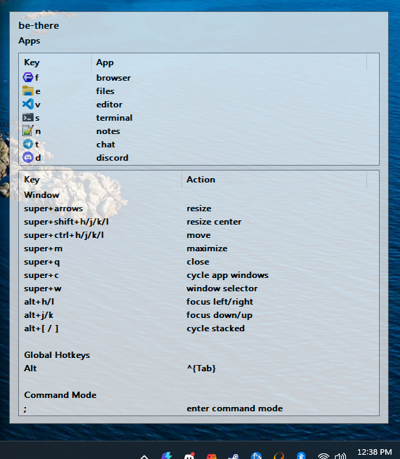
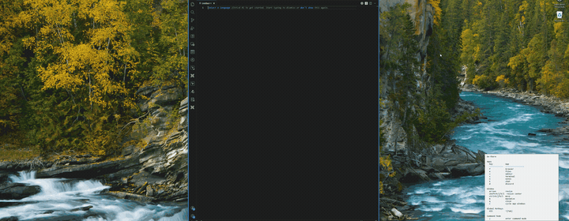
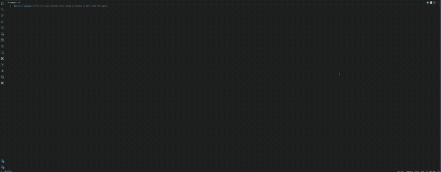
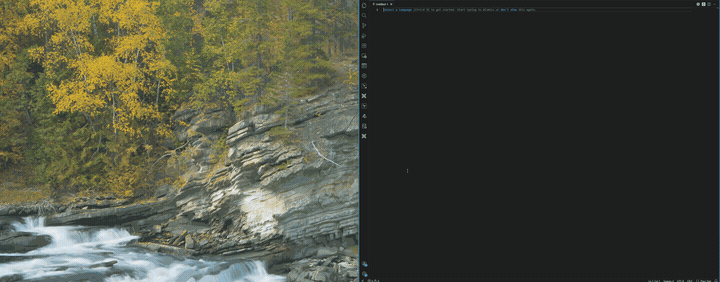
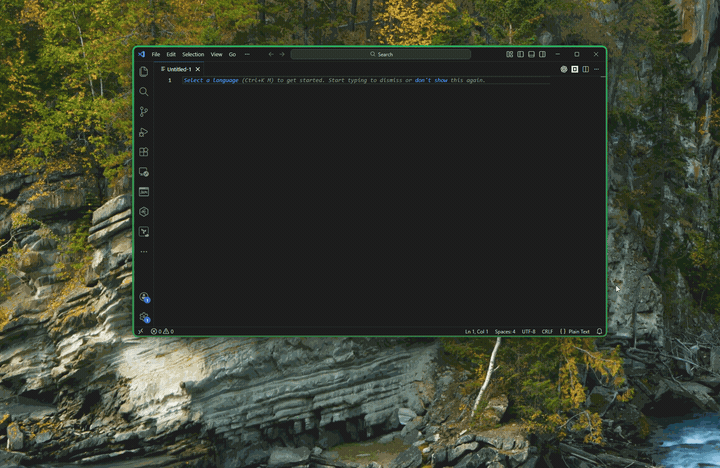
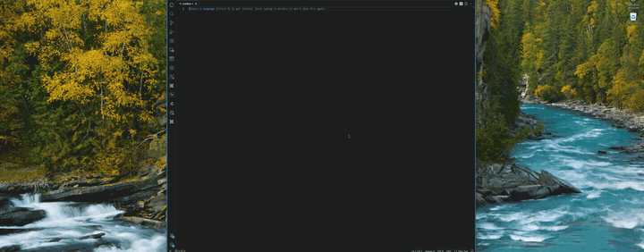

# be-there
A window manager written in AutoHotkey v2.

The aim is a low-friction workflow: a single super modifier, mnemonic app keys, and fast window actions. Alt+Tab and Win+Tab still work, but you will hardly use them

## Contents
- [What This Does](#what-this-does)
- [Quick Start](#quick-start)
- [Configuration](#configuration)
- [Default Config Keys](#default-config-keys)
- [Window Matching](#window-matching)
- [Path Expansion](#path-expansion)
- [Window Manager Exceptions](#window-manager-exceptions)
- [Helper Utility](#helper-utility)
- [Command Overlay](#command-overlay)
- [Known Limitations](#known-limitations)
- [Layout](#layout)
- [Third-Party](#third-party)

## What This Does

> [!NOTE]
> CapsLock is the default super key.

Show the [Command Overlay](#command-overlay) when the super key is held.

Jump focus to an app or launch it with `super + [letter]`.

Cycle centered window widths with `super + space`.

Maximizes/restores with `super + m`.

Move a window with `super + h/j/k/l`.

Freely move a window with double tap super + h/j/k/l

Resize edges with `super + shift + h/j/k/l`.

Other
- `super + alt` send `ctrl + tab` (configurable via `global_hotkeys`)
- `super + c` to cycle through windows of the same app

Enter Command Mode with `super + ;`.
- `r` to reload app/config
- `e` to open config file
- `w` opens a new window for the active program, if the program supports it
- `n` toggles the command overlay on or off
- `i` opens the [Helper Utility](#helper-utility)

## Configuration

### Quick start

- Start the program and enter command mode with `super + ;`.
- Press `e` to open the config file. You can also find it manually in `~/.config/be-there/config.json`.
- After making changes to your config you can reload the config (the entire program, actually) with `r` while in command mode.

### Default Config Keys
- `super_key`: key or modifier chord used as the super modifier (e.g., `CapsLock`, `Ctrl+Shift+Alt`).
- `apps`: list of app bindings with `hotkey`, `win_title`, and `run` command.
- `apps[].run_paths`: optional list of directories to search for the executable.
- `global_hotkeys`: array of scoped hotkey bindings (set `target_exes` empty for global use).
- `window`: resize/move steps and hotkeys (including move mode).
- `window_manager`: grid size, margins, and ignored window classes.
- `focus_border`: overlay appearance and update interval.
- `helper`: command overlay settings.
- `reload`: hotkey and file watch settings for config reload.

### Window Matching
- `apps[].win_title` accepts standard AutoHotkey window selectors.
- Common forms: plain title text, `ahk_exe <exe>`, `ahk_class <class>`, `ahk_pid <pid>`.
- Use `ahk_exe` for stable matching when window titles change (e.g., tabs/documents).
- Plain title text supports AutoHotkey's standard title matching and wildcards (e.g., `* - Notepad`).
- `ahk_exe`, `ahk_class`, and `ahk_pid` are exact matches; wildcards/regex are not supported today but could be added later.

### Path Expansion
- `apps[].run_paths` supports environment variables like `%APPDATA%` and `%LOCALAPPDATA%`.
- `~\` expands to your user profile (e.g., `~\AppData\Roaming`).

### Helper Utility
- `tools/window_inspector.ahk` lists active window titles, exe names, classes, and PIDs.
- Use it to identify values for `apps[].win_title` in your config.
- In Command Mode, press `i` to launch the window inspector.
- Use Refresh to update the list; Copy Selected/All or Export to save results.

## Known Limitations
- This has not been tested with multi-monitor setups.
- Dynamic grid ratios need to be added to support more screen sizes and resolutions for the window-snap function.
- Some apps (e.g., Discord) launch via `Update.exe` and keep versioned subfolders, which makes auto-resolution unreliable.
- For some apps that minimize or close to the system tray, it's recommended you disable that in the program. Otherwise you can try to set `apps[].run` to a stable full path (or use `run_paths`) in your config.
- Windows with elevated permissions may ignore be-there hotkeys unless be-there is run as Administrator.

## Third-Party
- JXON (AHK v2 JSON serializer) from https://github.com/TheArkive/JXON_ahk2
  - License: `LICENSES/JXON_ahk2-LICENSE.md`

## Similar tools and inspirations

There are a lot of window managers out there with various perspectives.
For this project I was primarily inspired by what I was able to accomplish with [Raycast](https://www.raycast.com/) on macOS. Between [Karabiner](https://karabiner-elements.pqrs.org/), Raycast, and [HammerSpoon](https://www.hammerspoon.org/) you could do all of `be-there` and more on macOS. As I needed to move back to windows for work, I wanted a way to use the same flow on Windows that I had become accustomed to on macOS.

Other macOS tools that I tried for more than five minutes were [AeroSpace](https://github.com/nikitabobko/AeroSpace) and [Loop](https://github.com/MrKai77/Loop).

### [FancyZones](https://learn.microsoft.com/en-us/windows/powertoys/fancyzones)

FancyZones is great in a lot of ways. But it doesn't help me avoid needing to know where things are in order to focus on them, and its features are insufficient for a truly keyboard-centered workflow.

### [Komorebi](https://github.com/LGUG2Z/komorebi)

I really like komorebi. I didn't use it for long and I have never been able to stick with tiling in the long run, but for those who prefer the tiling approach this might be the best option on Windows.

### [GlazeWM](https://github.com/glzr-io/glazewm)

GlazeWM is another popular tiling window manager.
